## Introduction

This repository demonstrates how to use AWS IoT Greengrass V2 and SageMaker for edge AI inference.

## What Is Edge Computing

Edge computing is a **distributed computing paradigm** that processes data closer to its source, resulting in reduced latency and bandwidth usage.

### Benefits

- **Low Latency**: Ideal for real-time applications like autonomous vehicles.
- **Enhanced Security**: Limits data exposure during transit.
- **Reduced Communication Costs**: Decreases dependency on centralized data centers.

### Challenges

- **Scaling**: Vertical scaling is less flexible than in the cloud.
- **Infrastructure Management**: Requires capacity planning and maintenance.

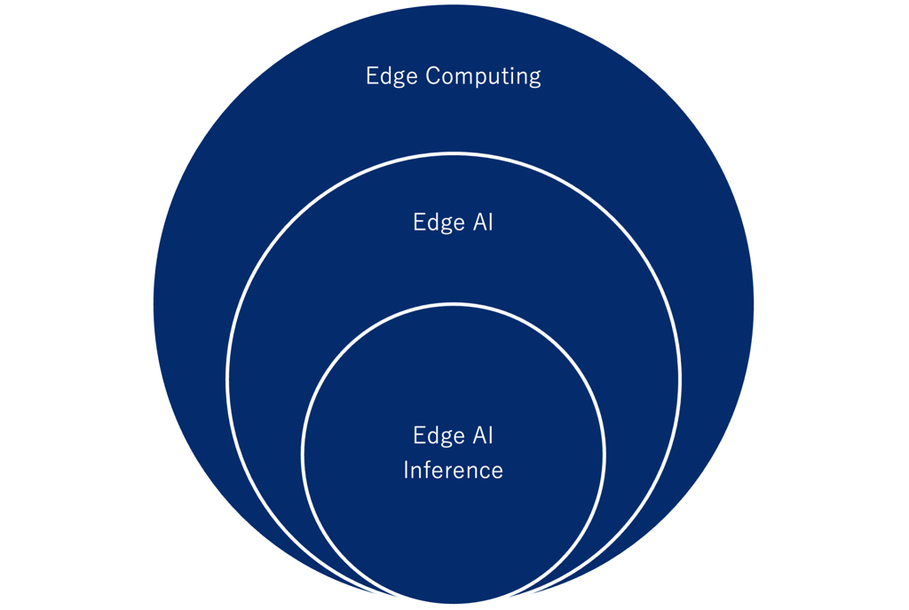

## AWS IoT Greengrass V2

### Overview

AWS IoT Greengrass is an **open-source IoT edge runtime and cloud service** designed for edge application deployment and management.

### Features

- Cross-platform support for **Linux** and **Windows**.
- Compatibility with both **x86** and **ARM architectures**.
- Integrated **Lambda functions** and **Deep Learning Runtime (DLR)**.

### Concepts

The IoT Greengrass V2 architecture revolves around the following key components:

- **Greengrass Core Devices**:
    - Serve as the main compute devices running Greengrass Core software at the edge.
    - Are **registered as AWS IoT Things**.
    - Facilitate communication with AWS cloud services.

- **Greengrass Client Devices**:
    - Connect to **Greengrass Core Devices** via **MQTT protocol**.
    - Are **registered as AWS IoT Things**.
    - Enable communication with other client devices when using a Greengrass Core Device as a message broker.

- **Greengrass Components**:
    - Represent software modules running on Greengrass Core Devices.
    - Are **customized and registered by users** to extend functionality.

- **Deployment**:
    - Comprises instructions managed by AWS for distributing configurations and components to Greengrass Core Devices.

This modular approach enables scalable and flexible edge computing, making IoT Greengrass V2 ideal for diverse IoT applications. For more information, refer to the [Key concepts for AWS IoT Greengrass](https://docs.aws.amazon.com/greengrass/v2/developerguide/how-it-works.html#concept-overview)

## Amazon SageMaker and Its Ecosystem

### SageMaker Overview

Amazon SageMaker is a **fully managed service** for building, training, and deploying machine learning models. It supports major deep learning frameworks such as TensorFlow and PyTorch.

### SageMaker Neo

Neo optimizes machine learning models for edge devices, ensuring compatibility and enhanced performance.


### SageMaker Edge Manager

This service manages and monitors edge-deployed machine learning models, offering capabilities like model optimization and security.

## Implementing Edge AI Inference

This repository demonstrates how to use an EC2 instance as an edge device to perform edge inference. The process involves a series of steps to set up, train, deploy, and test an edge inference pipeline.

### Steps to Implement Edge Inference

1. **Setting Up**
    - **Prepare AWS Resources**: Set up the necessary IAM roles, S3 buckets, and other AWS resources.
    - **Implement Training Script**: Write a script to train your model.
    - **Implement Inference Script**: Develop a script for model inference at the edge.

2. **Using SageMaker**
    - **Train with SageMaker**: Leverage SageMaker to train the model.
    - **Compile Model with SageMaker Neo**: Optimize the trained model for edge devices.
    - **Package Model with SageMaker Edge Manager**: Prepare the model for deployment to Greengrass Core.

3. **Configuring Greengrass**
    - **Set Up Greengrass Core**: Install and configure Greengrass Core on the EC2 instance.
    - **Register Greengrass Component**: Create a Greengrass Component for edge inference and register it.
    - **Deploy Greengrass Component**: Deploy the component to the Greengrass Core device.

4. **Testing**
    - **Convert Test Data**: Prepare input data in a format compatible with the edge model (e.g., Numpy arrays).
    - **Deploy Test Data**: Transfer the test data to the designated folder on the Greengrass Core device.
    - **Check Results**: Observe inference results in the Greengrass Core logs.

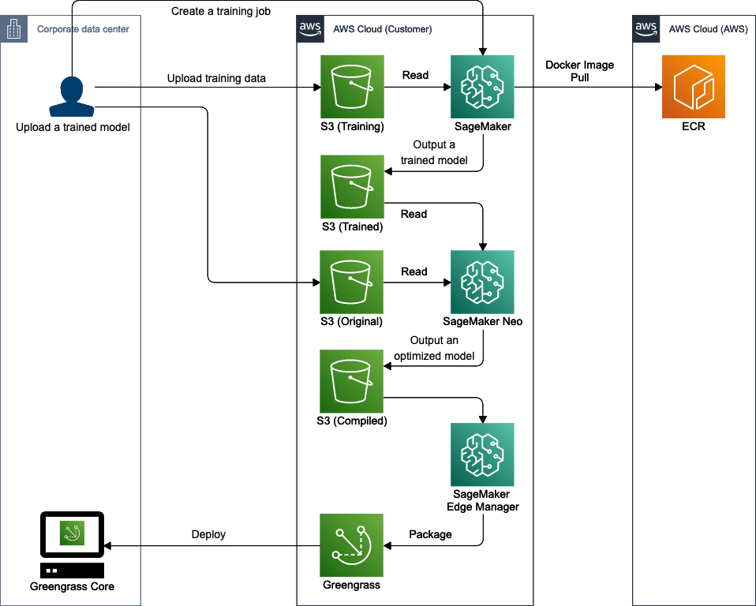

### Preparing AWS Resources

Prepare the following AWS resources beforehand. For specific details, refer to the [CloudFormation template](cfn.yaml) in this repository.

| **Resource** | **Name**                        | **Description**                      |
|--------------|---------------------------------|--------------------------------------|
| IAM User     | `greengrass-core-setup-user`   | For setting up Greengrass Core       |
| IAM Role     | `sagemaker-execution-role`     | SageMaker execution role             |
| IAM Role     | `GreengrassV2TokenExchangeRole`| Greengrass Core role                 |
| S3           | `sagemaker-ml-model-artifacts-{account_id}-{region}` | Bucket for ML models |

Run the following command to create these resources:

```shell
aws cloudformation deploy --template-file ./cfn.yaml --stack-name greengrass-sample --capabilities CAPABILITY_NAMED_IAM
```

### Implementing Training Script

#### Installing Dependencies

This example uses PyTorch's pre-trained **VGG16 model**. Install it using:

```shell
pip install torch torchvision
```

#### Writing the Script

Save the following script as `training.py` to execute in SageMaker:

```python
import argparse
import os
from datetime import datetime
import torch
from torchvision import models


def fit(model: torch.nn.modules.Module) -> None:
    # Add training code here
    pass


def save(model: torch.nn.modules.Module, path: str) -> None:
    suffix = datetime.now().strftime('%Y-%m-%d_%H-%M-%S')
    path = os.path.join(path, f'model-{suffix}.pt')
    # If you use `model.state_dict()`, SageMaker compilation will fail.
    torch.save(model, path)


def parse_args() -> argparse.Namespace:
    # hyperparameters sent by the client are passed as command-line arguments to the script.
    parser = argparse.ArgumentParser()
    parser.add_argument('--model_dir', type=str)
    parser.add_argument('--sm_model_dir', type=str, default=os.environ.get('SM_MODEL_DIR'))
    parser.add_argument('--train', type=str, default=os.environ.get('SM_CHANNEL_TRAIN'))
    parser.add_argument('--test', type=str, default=os.environ.get('SM_CHANNEL_TEST'))
    args, _ = parser.parse_known_args()
    return args


if __name__ == '__main__':
    args = parse_args()
    vgg16 = models.vgg16(pretrained=True)
    fit(vgg16)
    save(vgg16, args.sm_model_dir)
```

Refer to the [official SageMaker documentation](https://sagemaker.readthedocs.io/en/stable/overview.html) for additional details on runtime arguments, environment variables, and data handling.

### Implementing Inference Script

#### Installing Dependencies

Install [**Deep Learning Runtime (DLR)**](https://github.com/neo-ai/neo-ai-dlr) for model inference:

```shell
pip install dlr
```

#### Writing the Script

Save the following script as `inference.py` to run on your Greengrass Core:

```python
import argparse
import glob
import json
import os
import time

import numpy as np
from dlr import DLRModel


def load_model() -> DLRModel:
    return DLRModel('/greengrass/v2/work/vgg16-component')


def load_labels() -> dict:
    path = os.path.dirname(os.path.abspath(__file__))
    # See https://storage.googleapis.com/download.tensorflow.org/data/imagenet_class_index.json
    path = os.path.join(path, 'imagenet_class_index.json')
    with open(path, 'r') as f:
        return json.load(f)


def iter_files(path: str) -> str:
    path = path[:-1] if path.endswith('/') else path
    files = glob.glob(f'{path}/*.npy')
    for file in files:
        yield file


def predict(model: DLRModel, image: np.ndarray) -> np.ndarray:
    return model.run(image)[0]


def parse_args() -> argparse.Namespace:
    parser = argparse.ArgumentParser()
    parser.add_argument('--test_dir', type=str)
    parser.add_argument('--interval', type=int, default=300)
    args, _ = parser.parse_known_args()
    return args


def start(model: DLRModel, path: str, labels: dict) -> None:
    for file in iter_files(path):
        image = np.load(file)
        y = predict(model, image)
        index = int(np.argmax(y))
        label = labels.get(str(index), '')
        print(f'Prediction result of {file}: {label}')


if __name__ == '__main__':
    args = parse_args()
    print(f'args: {args}')
    model = load_model()
    labels = load_labels()

    if args.interval == 0:
        start(model, args.test_dir, labels)
    else:
        while True:
            start(model, args.test_dir, labels)
            print(f'Sleep in {args.interval} seconds...')
            time.sleep(args.interval)
```

> [!WARNING]
> PyTorch expects input data in `torch.Tensor` format, whereas models compiled by SageMaker Neo require `numpy.ndarray`. Refer to the [PyTorch pre-trained models documentation](https://pytorch.org/vision/stable/models.html#classification) for input shape details.

#### Registering an Inference Component

Upload your inference script and files as a zip file to an S3 bucket:

```shell
cd vgg16-inference-component
zip vgg16-inference-component-1.0.0.zip inference.py imagenet_class_index.json
aws s3 cp vgg16-inference-component-1.0.0.zip s3://{YOUR_BUCKET}/artifacts/
```

### Training with SageMaker

Install the SageMaker Python SDK:

```shell
pip install sagemaker
```

To queue a training job, create a script (`training_job.py`) to define the job:

```python
from sagemaker.pytorch import PyTorch

AWS_ACCOUNT_ID = '123456789012'
S3_BUCKET = f's3://sagemaker-ml-model-artifacts-{AWS_ACCOUNT_ID}-ap-northeast-1'

if __name__ == '__main__':
    pytorch_estimator = PyTorch(
        entry_point='training.py',
        source_dir='./',
        role='sagemaker-execution-role',
        instance_count=1,
        instance_type='ml.m5.large',
        framework_version='1.10.0',
        py_version='py38',
        output_path=f'{S3_BUCKET}/models/trained',
        hyperparameters={}
    )
    pytorch_estimator.fit()
```

The model will be stored in your S3 bucket as `output/model.tar.gz`, after which it will be compiled and optimized with SageMaker Neo.

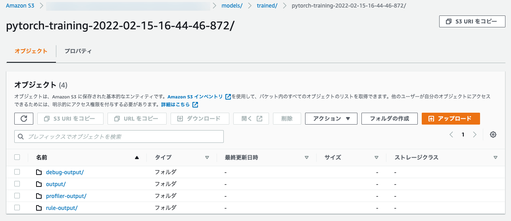

### Compiling Models with SageMaker Neo

Initiate a SageMaker compilation job, which in this example, completed in approximately 4 minutes.

> [!WARNING]
> Once created, the job cannot be deleted or hidden.


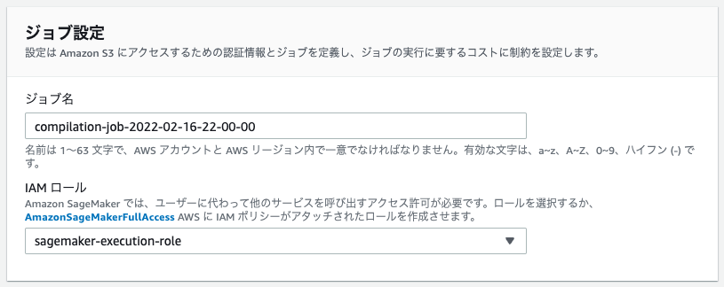

Define the input configuration as follows:

| **Field**         | **Value**                                                               |
|--------------------|-------------------------------------------------------------------------|
| **Artifact**       | S3 URI of `model.tar.gz`                                               |
| **Input shape**    | [Model input shape](https://pytorch.org/vision/stable/models.html#classification) |
| **Framework**      | PyTorch                                                                |
| **Framework version** | 1.8                                                                  |

For input shape details, the [official documentation](https://pytorch.org/vision/stable/models.html#classification) specifies:

> All pre-trained models expect input images normalized in the same way, i.e., **mini-batches of 3-channel RGB images of shape (3 x H x W), where H and W are expected to be at least 224.**

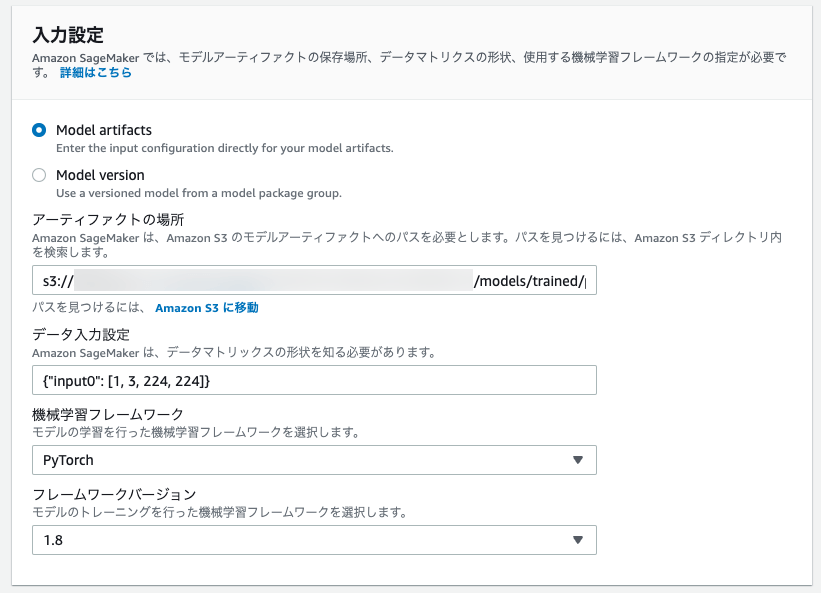

Specify the output configuration based on your preferences.

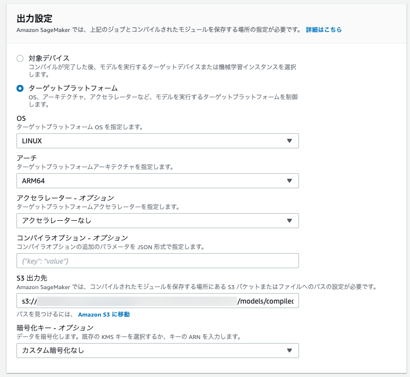

> [!WARNING]
> If you select `rasp4b` as the `Target device`, the models will be compiled for a 64-bit architecture. Consequently, these models cannot be loaded onto a 32-bit operating system, such as the Raspberry Pi 32-bit OS. In this scenario, ensure you use a 64-bit OS instead.

Although this detail is not mentioned in the official AWS documentation, it has been discussed in the [AWS Forum](https://forums.aws.amazon.com/thread.jspa?threadID=328453). At the bottom of the page, you may observe the following:

> The library libdlr.so compiled by SageMaker Neo with target rasp4b returns "ELF-64 bit LSB pie executable, ARM aarch64, version 1 (GNU/Linux), dynamically linked.

If no specific configurations are required, you can proceed with the default settings.

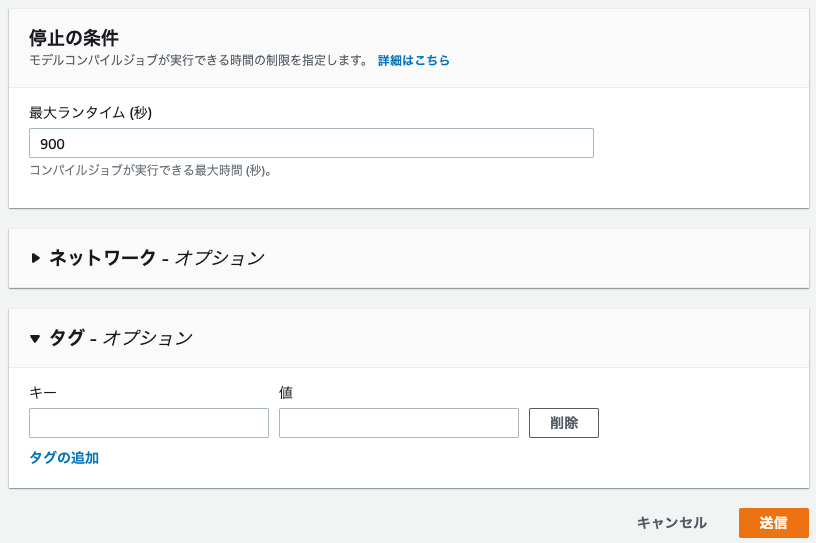

### Packaging Model with SageMaker Edge Manager

To package your model for deployment, create a SageMaker Edge Packaging Job.


> [!WARNING]
> Once created, the job cannot be deleted or hidden.


Enter the SageMaker Neo compilation job name to proceed.

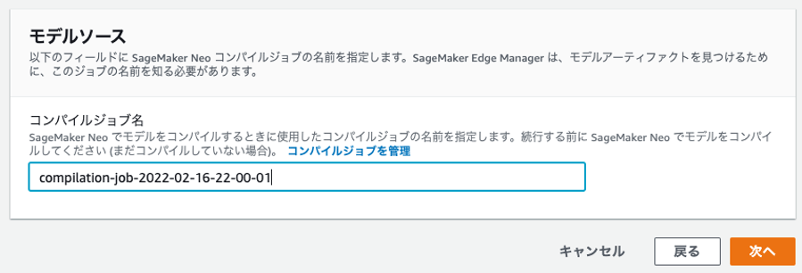

If you choose the `Greengrass V2 component` as the deployment preset, the compiled model will be:

- Registered as a Greengrass V2 component by SageMaker Edge.
- Saved to `/greengrass/v2/work/vgg16-component/` on the Greengrass Core device.


### Setting Up Greengrass Core

Set up Greengrass Core on your edge device. In this example, an EC2 instance running Ubuntu 20.04.03 is used. For detailed installation instructions, refer to the [AWS Greengrass Core documentation](https://docs.aws.amazon.com/greengrass/v2/developerguide/quick-installation.html).

Please note that MQTT over TLS [requires port 8883](https://docs.aws.amazon.com/greengrass/v2/developerguide/configure-greengrass-core-v2.html#configure-alpn-network-proxy). If this port is not open, follow the [manual setup guide](https://docs.aws.amazon.com/greengrass/v2/developerguide/manual-installation.html).

#### Install JDK

```shell
sudo apt install default-jdk
java -version
```

#### Add a User and Group for Greengrass Core

```shell
sudo useradd --system --create-home ggc_user
sudo groupadd --system ggc_group
```

#### Configure AWS Credentials

> [!WARNING]
> It is highly recommended to use temporary credentials.

```shell
# Set the credentials for greengrass-core-setup-user provisioned by CloudFormation
export AWS_ACCESS_KEY_ID=
export AWS_SECRET_ACCESS_KEY=
```

#### Install Greengrass Core

```shell
curl -s https://d2s8p88vqu9w66.cloudfront.net/releases/greengrass-nucleus-latest.zip > greengrass-nucleus-latest.zip
unzip greengrass-nucleus-latest.zip -d GreengrassInstaller && rm greengrass-nucleus-latest.zip
sudo -E java -Droot="/greengrass/v2" -Dlog.store=FILE \
  -jar ./GreengrassInstaller/lib/Greengrass.jar \
  --aws-region ap-northeast-1 \
  --thing-name MyGreengrassCore \
  --thing-group-name MyGreengrassCoreGroup \
  --thing-policy-name GreengrassV2IoTThingPolicy \
  --tes-role-name GreengrassV2TokenExchangeRole \
  --tes-role-alias-name GreengrassCoreTokenExchangeRoleAlias \
  --component-default-user ggc_user:ggc_group \
  --provision true \
  --setup-system-service true
```

#### Check the Greengrass Core Service

Ensure the device has at least 2GB of memory for optimal performance.

```shell
% sudo systemctl status greengrass
● greengrass.service - Greengrass Core
     Loaded: loaded (/etc/systemd/system/greengrass.service; enabled; vendor preset: enabled)
     Active: active (running) since Wed 2022-02-16 05:09:16 UTC; 1 day 2h ago
   Main PID: 1454 (sh)
      Tasks: 51 (limit: 2197)
     Memory: 734.2M
     CGroup: /system.slice/greengrass.service
```

#### Automatic Resource Provisioning

This guide uses [automatic resource provisioning](https://docs.aws.amazon.com/greengrass/v2/developerguide/quick-installation.html). If preferred, resources can also be manually provisioned using the [manual provisioning guide](https://docs.aws.amazon.com/greengrass/v2/developerguide/manual-installation.html).

| **Resource**           | **Name**                   |
|-------------------------|----------------------------|
| **Thing**               | MyGreengrassCore          |
| **Thing Group**         | MyGreengrassCoreGroup     |
| **Thing Policy**        | GreengrassV2IoTThingPolicy |
| **Token Exchange Role** | GreengrassV2TokenExchangeRole |
| **Role Alias**          | GreengrassCoreTokenExchangeRoleAlias |

### Registering Greengrass Component for Edge Inference

#### Creating Component Recipe

To enable edge inference, create a `recipe.yaml` file to register a Greengrass Component. For more details on component recipes, refer to the [official documentation](https://docs.aws.amazon.com/greengrass/v2/developerguide/component-recipe-reference.html).

```yaml
RecipeFormatVersion: '2020-01-25'

ComponentName: vgg16-inference-component
ComponentVersion: 1.0.0
ComponentDescription: Inference component for VGG16
ComponentPublisher: Iret

# Arguments to be passed
ComponentConfiguration:
  DefaultConfiguration:
    Interval: 60

# Dependencies which will be installed with this component
ComponentDependencies:
  variant.DLR:
    VersionRequirement: ">=1.6.5 <1.7.0"
    DependencyType: HARD
  vgg16-component:
    VersionRequirement: ">=1.0.0"
    DependencyType: HARD

Manifests:
- Name: Linux
  Platform:
    os: linux
  Lifecycle:
    Run:
      RequiresPrivilege: true
      Script: |
        . {variant.DLR:configuration:/MLRootPath}/greengrass_ml_dlr_venv/bin/activate
        python3 -u {artifacts:decompressedPath}/vgg16-inference-component-1.0.0/inference.py --interval {configuration:/Interval} --test_dir {work:path}/images/
  Artifacts:
  - Uri: s3://sagemaker-ml-model-artifacts-123456789012-ap-northeast-1/artifacts/vgg16-inference-component-1.0.0.zip
    Unarchive: ZIP
```

In this example, `Interval` specifies the time between inference runs.

#### Specifying Component Dependencies

Dependencies are listed in `ComponentDependencies`. For this example, the following components are required:

- `variant.DLR`: Required for loading models compiled by SageMaker Neo. It includes a Python virtual environment located at `/greengrass/v2/work/variant.DLR/greengrass_ml/greengrass_ml_dlr_venv`. More details are available in the [official documentation](https://docs.aws.amazon.com/greengrass/v2/developerguide/dlr-component.html).
- `vgg16-component`: The model compiled by SageMaker Neo and registered by SageMaker Edge Manager.

#### Creating the Component

Once `recipe.yaml` is complete, create the Greengrass component.

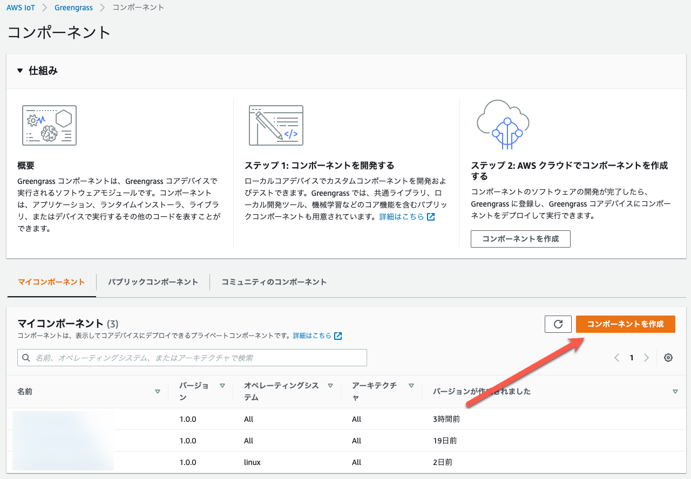

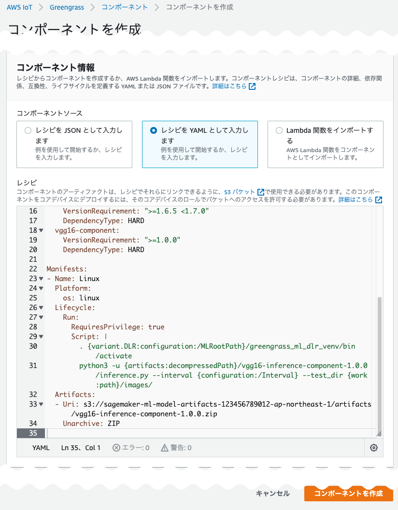

> [!WARNING]
> Greengrass Core validates the checksum of artifacts. If artifacts are directly overwritten, the component status may break. Refer to the [troubleshooting guide](https://docs.aws.amazon.com/greengrass/v2/developerguide/troubleshooting.html#core-error-failed-to-download-artifact-checksum-mismatch-exception) for more details.

### Deploying Greengrass Component

#### Configure Deployment

Press the `Create` button.

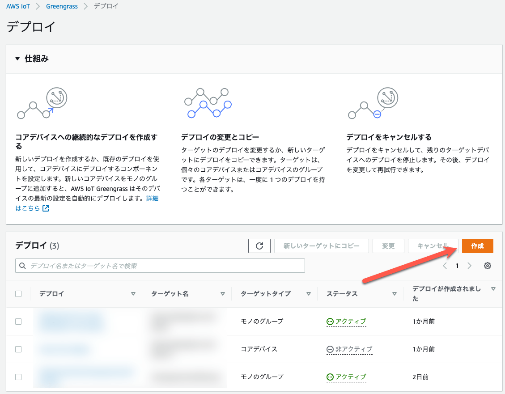

Enter `vgg16-inference-deployment` in the `Name` field and press the `Next` button.


#### Select Components to Deploy.

- **My Components:**
    - `vgg16-component`: The VGG16 model packaged by SageMaker Edge Manager.
    - `vgg16-inference-component`: The inference component.

- **Public Components:**
    - `variant.DLR`: Required for loading models.
    - `aws.greengrass.Nucleus`: Core functionality for Greengrass.

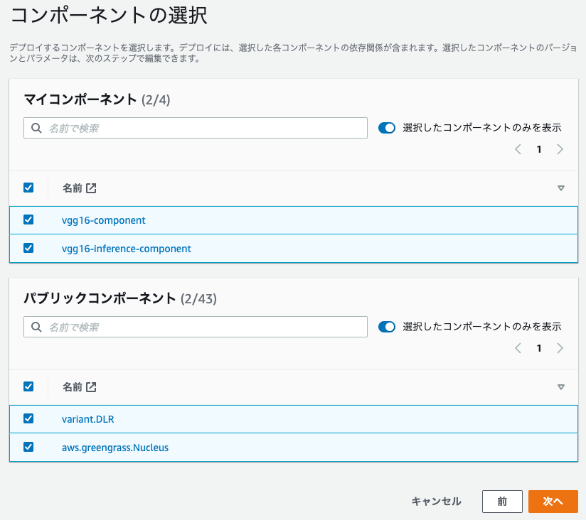

#### Configure Components

Press `Next` without making configuration changes.

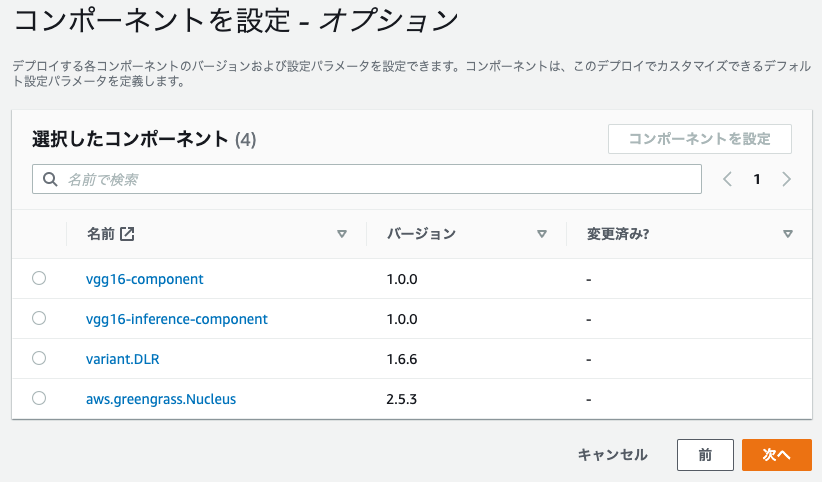


#### Review and Deploy

After reviewing the deployment configuration, press `Deploy` to start deploying the components.


### Testing

To test inference on your Greengrass Core, follow these steps:

1. **Prepare Input Data:**<br/>
   Pre-trained PyTorch models require a 4-dimensional tensor `(N, C, H, W)` as input. Convert your image into a Numpy array. For more details, refer to the [official documentation](https://pytorch.org/vision/stable/models.html#classification).

2. **Transfer Data to Greengrass Core:**<br/>
   Move the converted data to the directory `/greengrass/v2/work/vgg16-inference-component/images/` on your Greengrass Core device.

3. **View Inference Logs:**<br/>
   Check the file `/greengrass/v2/logs/vgg16-inference-component.log` for inference results on your Greengrass Core device.

#### Python Script to Convert Images to Numpy Array

You can use the following Python script to prepare images for inference:

```python
import argparse
import os
from PIL import Image

import numpy as np
import torch
from torchvision import transforms


def load_image_to_tensor(path: str) -> torch.Tensor:
    preprocess = transforms.Compose([
        transforms.Resize(256),
        transforms.CenterCrop(224),
        transforms.ToTensor(),
        transforms.Normalize(mean=[0.485, 0.456, 0.406], std=[0.229, 0.224, 0.225]),
    ])

    img = Image.open(path)
    tensor_3d = preprocess(img)
    return torch.unsqueeze(tensor_3d, 0)


def save(tensor: torch.Tensor, path: str) -> None:
    np.save(path, tensor.numpy())


def parse_args() -> argparse.Namespace:
    parser = argparse.ArgumentParser()
    parser.add_argument('image', type=str)
    args, _ = parser.parse_known_args()
    return args


if __name__ == '__main__':
    args = parse_args()
    image = args.image

    tensor = load_image_to_tensor(image)
    save(tensor, os.path.basename(image) + '.npy')
```

#### Run the Script

Use the script to convert an image to Numpy array format:

```shell
python convert_img_to_npy.py <YOUR_IMAGE>
```

#### Transfer Data

Transfer the converted Numpy array to your Greengrass Core device:

```shell
scp xxx.jpg.npy <GREENGRASS_HOST>://greengrass/v2/work/vgg16-inference-component/images/
```

#### Check Inference Logs

SSH into the Greengrass Core device and check inference logs:

```shell
ssh <GREENGRASS_HOST>
tail -f /greengrass/v2/logs/vgg16-inference-component.log
```

#### Example Inference Results

Below are examples of inference results logged in `/greengrass/v2/logs/vgg16-inference-component.log`:

```text
2022-02-19T21:32:21.993Z [INFO] (Copier) vgg16-inference-component: stdout. Prediction result of /greengrass/v2/work/vgg16-inference-component/images/keyboard.jpg.npy: ['n03085013', 'computer_keyboard']. {scriptName=services.vgg16-inference-component.lifecycle.Run.Script, serviceName=vgg16-inference-component, currentState=RUNNING}
2022-02-19T21:32:22.257Z [INFO] (Copier) vgg16-inference-component: stdout. Prediction result of /greengrass/v2/work/vgg16-inference-component/images/pen.jpg.npy: ['n03388183', 'fountain_pen']. {scriptName=services.vgg16-inference-component.lifecycle.Run.Script, serviceName=vgg16-inference-component, currentState=RUNNING}
```

The inference results for the images below are as follows:

1. **Image: `computer_keyboard`**


2. **Image: `fountain_pen`**


## Conclusion

The integration of AWS IoT Greengrass V2 and SageMaker empowers developers to bring intelligent machine learning capabilities to edge devices efficiently. Throughout this guide, we explored the lifecycle of edge AI inference, from model training and optimization to deployment and testing on Greengrass Core devices.

Happy Coding! 🚀
